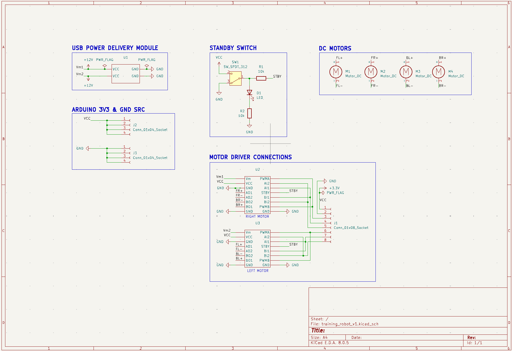

# Training-Robot-PCBs

Repository for training robot pcb designs and schematics

### STATUS
Original footprints were created for motor driver and power delivery breakout boards. PCB layout must be done next.

### CURRENT SIMPLE DESIGN

